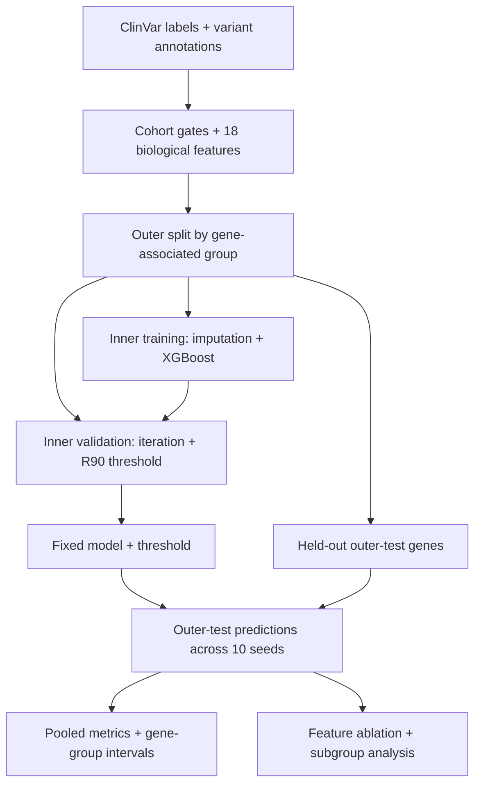

# Hearing-loss variant classification: generalization to unseen genes

[](https://github.com/NingyuSUN/clinvar-hearingloss-ml/actions/workflows/ci.yml)
[](LICENSE)

**How well does a ClinVar pathogenicity classifier generalize to genes excluded
from training, and which biological features drive its predictions?**

This research project combines ClinVar labels, VEP annotations, gnomAD frequency
and gene constraint, protein domains, and conservation in an XGBoost pipeline.
It demonstrates gene-group evaluation, feature ablation, out-of-fold attribution,
and reproducible inference. It is not a clinical diagnostic tool.

## Evaluation workflow



This shows the completed model evaluation and frozen-prediction reanalysis.
The five-model prediction demo below is a separate deliverable; probability calibration and independent external validation
are outside the completed evaluation.

## Main findings

Published results use seed-averaged out-of-fold predictions from grouped
five-fold evaluation over ten seeds.

| Evaluation cohort | Variants | Pooled ROC-AUC [95% interval] |
|---|---:|---:|
| Headline: feature-complete, ClinVar review status ≥1 star | 7,125 | 0.930 [0.892, 0.974] |
| Coding non-truncating subset | 3,121 | 0.815 [0.702, 0.920] |

The headline cohort contains 167 gene groups. A separate random-row-split
comparison reports AUC around 0.996, illustrating how much the evaluation changes
when genes can appear on both sides of the split.

Feature ablations and SHAP highlight consequence type and allele frequency.
At the headline model's validation-selected R90 threshold, outer-test pooled
recall is **0.845**, and coding non-truncating recall is **0.530**.
A validation target of 90% recall does not guarantee that recall on new genes.

**Coding non-truncating is not strict missense.** Historical result filenames
containing `missense` refer to the broader subset. The [statistical revision](docs/statistical_revision.md)
uses 2,000 whole-gene-group bootstrap draws, conditional on fixed predictions;
intervals exclude retraining and full CV dependence. Ablation differences are
descriptive, without independent-fold significance claims.
See [results](docs/results.md) and [validation status](docs/validation_status.md).

## Try the frozen prediction demo

From the repository root, using Python 3.11 or later:

```bash
pip install -r predict/requirements-inference.txt
python predict/predict_variants.py --input predict/examples/input.csv --bundle predict/bundle --output demo_output/
python predict/render_variant_report.py --predictions demo_output/predictions.jsonl --variant-id 48
```

Use a fresh output directory. This replays supported variants in the frozen
annotation cache across five bundled model configurations; it does not annotate
arbitrary new variants. Scores are uncalibrated.
Read the [prediction contract](docs/predict.md) for supported inputs and model provenance.

## Evaluation and reproduction

Gene co-occurrence defines the split groups. Inner training data determine
imputation; an inner gene-group holdout selects model iteration and threshold.
Outer-test genes are excluded from these choices.

```bash
conda env create -f environment.yml
conda activate hearingloss-variants
pip install -e .
python scripts/run_evaluation.py --out runs/readme_reproduction
python scripts/analyze_results.py --dir runs/readme_reproduction
```

This trains models from the committed modelling matrix and can take time.
Use a new output directory to preserve published results.
[Methods](docs/methods.md) explain the protocol; [data](docs/data.md) explains
the matrix and the `HLPATH_DATA` override.

## Scope and next steps

VUS/conflicting labels are excluded; frequency partly overlaps the evidence used
to assign ClinVar labels. Conservation provenance remains unresolved. The
[live annotation path](docs/predict_novel.md) blocks models that require the unresolved conservation feature
and has no independent external validation; the frozen demo is the review entrypoint.

Probability calibration and independent external validation remain research
boundaries. Strict-missense evaluation and robustness work are tracked in [project status](PROJECT_STATUS.md).
[Engineering case study](docs/engineering_case_study.md) · [Model card](MODEL_CARD.md) · [Limitations](docs/limitations.md) ·
[SHAP analysis](docs/shap.md) · [CI checks](.github/workflows/ci.yml)
